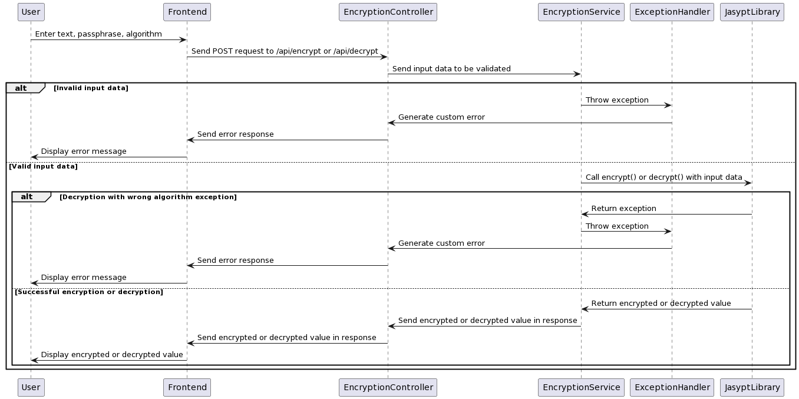

# Symmetric Encryption/Decryption API

This is a Spring Boot application that provides a REST API for encrypting and decrypting text using the Jasypt library.

## Table of Contents

- [Getting Started](#getting-started)
    - [Prerequisites](#prerequisites)
    - [Installation](#installation)
- [Usage](#usage)
    - [Diagram](#diagram)
    - [Running the application](#running-the-application)
    - [API Usage](#api-usage)
      - [Example](#example)

# Getting Started

## Prerequisites

- Java 8 or higher
- Maven

## Installation

1. Clone the repository:  
    ```sh
    git clone https://github.com/mohammed-lahbil/symmetric-encryption-back.git
    ```
2. Navigate to the project directory: 
    ```sh
    cd symmetric-encryption-back
    ```

# Usage

## Diagram


## Running the application

1. Build the application using Maven:
    ```sh
    mvn clean install
    ```
2. Run the application using Maven:
    ```sh
    mvn spring-boot-run
    ```
3. Run unit tests (Optional)
    ```sh
    mvn test
    ```

The application will run on port 8000. You can access the API using the following endpoints:

- Encrypt: POST request to `http://localhost:8000/api/encrypt`
- Decrypt: POST request to `http://localhost:8000/api/decrypt`

## API Usage

The Encryption endpoint accepts JSON payloads with the following properties:

- `decryptedText`: The text value to encrypt or decrypt
- `passPhrase`: The passphrase for symmetric encryption/decryption
- `algorithm`: The algorithm to use for encryption/decryption (default: Basic)

The Decryption endpoint accepts JSON payloads with the following properties:

- `encryptedText`: The text value to encrypt or decrypt
- `passPhrase`: The passphrase for symmetric encryption/decryption
- `algorithm`: The algorithm to use for encryption/decryption (default: Basic)

### Example

POST request to `http://localhost:8080/api/encrypt` with the following JSON payload:

```json  
{  
    "decryptedText": "hello world",  
    "passPhrase": "mysecretkey",  
    "algorithm": "Basic"
}
```
Result 
```json
{
    "encryptedText": "0MmCnN/jNMvzGCQQDRecvhx751KzWC/D",
    "passPhrase": "mysecretkey",
    "algorithm": "Basic"
}
```
